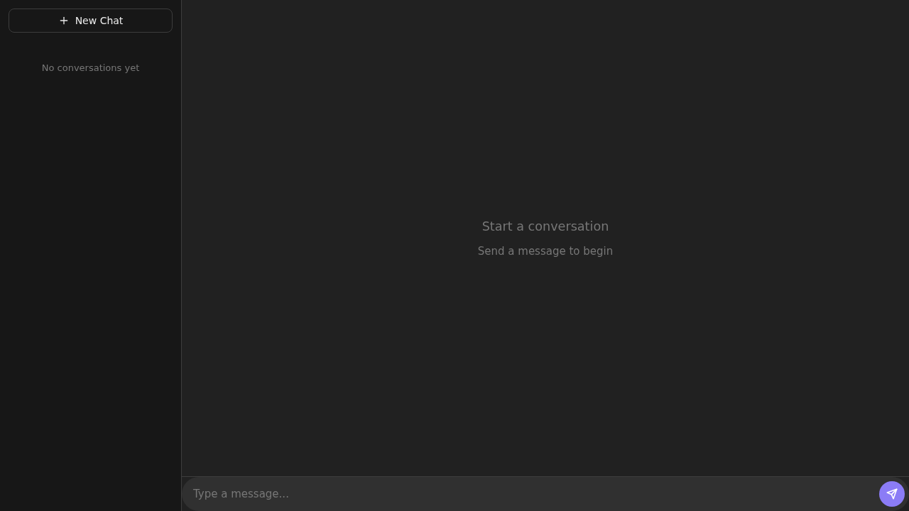
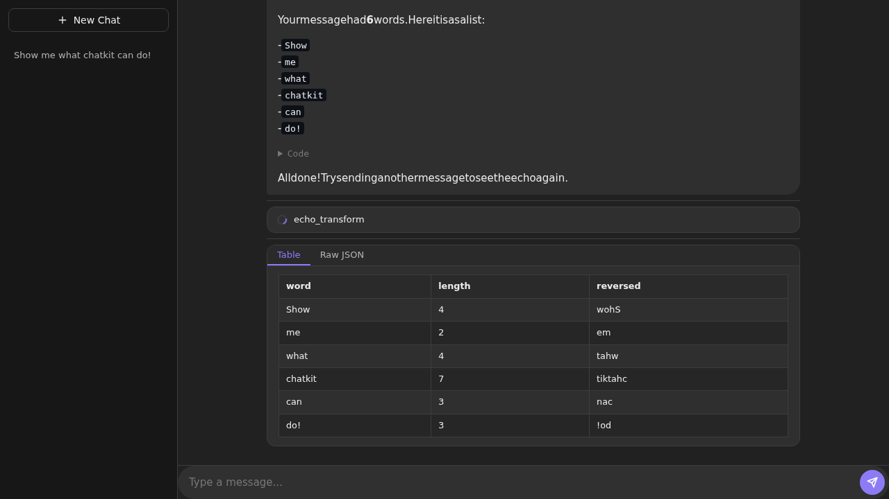

# Chatkit

Reusable Web Components chat UI with SSE streaming.

Chatkit gives you a set of custom elements (`<ck-messages>`, `<ck-input>`, etc.) that connect to any backend speaking a simple SSE protocol. A companion Python package provides Pydantic models and FastAPI helpers for the server side.





## Try the Demo

No API keys needed. The echo demo responds to any message with formatted markdown, tool cards, code blocks, and data artifacts:

```bash
git clone https://github.com/EvanOman/chatkit.git
cd chatkit
npm install && npx vite build

cd demo
pip install -r requirements.txt
pip install -e ../python
python server.py
```

Open http://127.0.0.1:19800 and send a message.

## Quick Start

### Frontend

Install from GitHub at a specific commit:

```bash
npm install github:EvanOman/chatkit#<commit-hash>
```

Or track the latest `main`:

```bash
npm install github:EvanOman/chatkit
```

To update after upstream changes, reinstall with the new hash or run:

```bash
npm update chatkit
```

```js
// Register all components as custom elements
import "chatkit/register";

// Import the theme
import "chatkit/theme/chatkit.css";
```

Then use the components in HTML:

```html
<ck-sidebar></ck-sidebar>
<div style="display:flex; flex-direction:column; flex:1; height:100vh">
  <ck-messages></ck-messages>
  <ck-input></ck-input>
</div>
```

### Backend (Python)

```bash
pip install chatkit[fastapi]
```

```python
from chatkit import ChatEvent, stream_chat_events

async def my_chat(thread_id, message, metadata):
    yield ChatEvent.init(thread_id=thread_id or "new-id")
    yield ChatEvent.text("Hello!")
    yield ChatEvent.done()
```

## Components

| Component | Tag | Description |
|-----------|-----|-------------|
| **CkSidebar** | `<ck-sidebar>` | Conversation thread list with "New Chat" button. Slide-out drawer on mobile (<768px). |
| **CkMessages** | `<ck-messages>` | Scrollable message container with turn grouping, auto-scroll, and status indicator. |
| **CkMessage** | `<ck-message>` | Single chat bubble (user or assistant). Streams markdown via `streaming-markdown` with DOMPurify sanitization. |
| **CkInput** | `<ck-input>` | Text input with send/stop button. Dispatches `ck-submit` on send, `ck-stop` during streaming. |
| **CkToolCard** | `<ck-tool-card>` | Tool use/done indicator with spinner animation. |
| **CkArtifact** | `<ck-artifact>` | Tabbed rich card for structured data (charts, tables, etc.). Accepts JSON data with configurable tabs. |

Components are registered by importing `chatkit/register`. You can also import individual classes from `chatkit` and register them yourself.

## SSE Protocol

The backend streams Server-Sent Events over a POST request. Each event has a `type` and `data` field.

### Event Types

| Event | Required | Data | Description |
|-------|----------|------|-------------|
| `init` | Yes | `{"thread_id": "...", "protocol_version": 1}` | First event. Establishes the thread ID. |
| `text` | Yes | Plain string | Streamed text chunk (markdown supported). |
| `done` | Yes | `{}` | Signals stream completion. Must be the final event. |
| `error` | Yes | Plain string | Error message. Terminates the stream. |
| `status` | No | Plain string | Status message (e.g., "Searching..."). |
| `code` | No | Plain string | Source code being executed. |
| `tool_use` | No | `{"tool": "...", "input": {...}}` | Tool invocation started. |
| `tool_done` | No | `{"tool": "...", "summary": "..."}` | Tool invocation completed. |
| `artifact` | No | `{"id": "...", "type": "...", "data": {...}}` | Structured artifact (chart, table, etc.). |

Every stream must begin with `init` and end with either `done` or `error`.

## REST Endpoints

Chatkit components expect these endpoints relative to the configured API base URL:

| Method | Path | Required | Description |
|--------|------|----------|-------------|
| `POST` | `/chat` | Yes | Send a message. Request body: `{"thread_id": str \| null, "message": str, "metadata": {}}`. Returns an SSE stream. |
| `GET` | `/conversations` | No | List conversation threads. Returns `[{"id", "title", "created_at", "updated_at"}, ...]`. |
| `DELETE` | `/conversations/:id` | No | Delete a conversation thread. |

## Python Helpers

```bash
pip install chatkit            # Core: events + models
pip install chatkit[fastapi]   # Adds sse-starlette for streaming
```

### ChatEvent Factory Methods

```python
from chatkit import ChatEvent

ChatEvent.init(thread_id="abc-123")
ChatEvent.text("Here is the answer...")
ChatEvent.status("Searching database...")
ChatEvent.code("print('hello')")
ChatEvent.tool_use("sql_query", {"query": "SELECT ..."})
ChatEvent.tool_done("sql_query", "Found 42 rows")
ChatEvent.artifact("chart-1", "plotly", {"data": [...], "layout": {...}})
ChatEvent.error("Something went wrong")
ChatEvent.done()
```

### SSEPayload

Converts a `ChatEvent` to the dict format expected by `sse-starlette`:

```python
from chatkit import SSEPayload, ChatEvent

payload = SSEPayload.from_chat_event(ChatEvent.text("hi"))
payload.to_dict()  # {"event": "text", "data": "hi"}
```

### stream_chat_events()

Adapter that converts an `AsyncGenerator[ChatEvent]` into the `AsyncGenerator[dict]` that `EventSourceResponse` expects:

```python
from sse_starlette import EventSourceResponse
from chatkit import ChatRequest, stream_chat_events

@app.post("/chat")
async def chat(request: ChatRequest):
    events = backend.chat(request.thread_id, request.message, request.metadata)
    return EventSourceResponse(stream_chat_events(events), ping=15)
```

### ChatBackend Protocol

Implement this protocol for type-safe backends:

```python
from chatkit import ChatBackend, ChatEvent

class MyBackend(ChatBackend):
    async def chat(self, thread_id, message, metadata=None):
        yield ChatEvent.init(thread_id=thread_id or "new")
        yield ChatEvent.text("Hello")
        yield ChatEvent.done()
```

## Theming

Import the theme CSS to set all `--ck-*` custom properties:

```html
<link rel="stylesheet" href="chatkit/theme/chatkit.css">
```

**Dark mode** is the default. Switch to light mode by adding `class="light"` or `data-theme="light"` to `<html>`.

### Key CSS Custom Properties

| Property | Default (dark) | Description |
|----------|---------------|-------------|
| `--ck-bg` | `#212121` | Main background |
| `--ck-bg-sidebar` | `#171717` | Sidebar background |
| `--ck-bg-surface` | `#2f2f2f` | Card/surface background |
| `--ck-text` | `#ececec` | Primary text color |
| `--ck-accent` | `#8b7cf6` | Accent/brand color |
| `--ck-border` | `#3d3d3d` | Border color |
| `--ck-radius` | `0.75rem` | Default border radius |
| `--ck-sidebar-width` | `16rem` | Sidebar width |
| `--ck-max-message-width` | `48rem` | Message content max width |
| `--ck-font` | `Inter, system-ui, sans-serif` | Body font |
| `--ck-font-mono` | `Fira Code, Cascadia Code, monospace` | Code font |

Override any property in your own CSS to customize the look.

## DOM Events

All events bubble and are composed (cross shadow DOM boundaries).

| Event | Source | Detail | Cancelable | Description |
|-------|--------|--------|------------|-------------|
| `ck-submit` | `<ck-input>` | `{ message: string }` | No | User submitted a message. |
| `ck-stop` | `<ck-input>` | None | No | User clicked the stop button during streaming. |
| `ck-new-chat` | `<ck-sidebar>` | None | No | User clicked "New Chat". |
| `ck-thread-select` | `<ck-sidebar>` | `{ threadId: string }` | No | User selected a conversation thread. |
| `ck-thread-delete` | `<ck-sidebar>` | `{ threadId: string }` | Yes | User clicked delete on a thread. Call `preventDefault()` to cancel. |

### SSE Client

The `connectSSE` function handles POST-based SSE streaming:

```js
import { connectSSE } from "chatkit/sse";

const sse = connectSSE("/api/chat", {
  body: { thread_id: null, message: "Hello", metadata: {} },
  signal: controller.signal,
});

for await (const event of sse) {
  if (event.event === "text") appendText(event.data);
  if (event.event === "done") break;
}
```

## License

MIT
